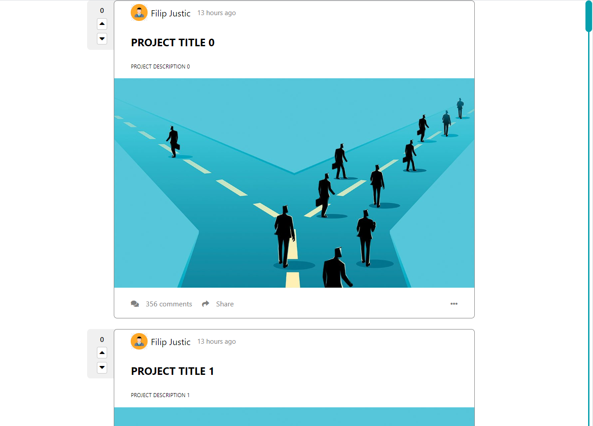

# Infinite Scroll React Posts

Features
* implement infinite scroll using react-infinite-scroll-component
* customize scrollbar



### How to use react-infinite-scroll-component

```bash
  npm install --save react-infinite-scroll-component
// in code ES6
  import InfiniteScroll from 'react-infinite-scroll-component';
  // or commonjs
  var InfiniteScroll = require('react-infinite-scroll-component');
```

code
```javascript
InfiniteScroll
  dataLength={items.length} //This is important field to render the next data
  next={fetchData}
  hasMore={true}
  loader={<h4>Loading...</h4>}
  endMessage={
    <p style={{textAlign: 'center'}}>
      <b>Yay! You have seen it all</b>
    </p>
  }
  // below props only if you need pull down functionality
  refreshFunction={this.refresh}
  pullDownToRefresh
  pullDownToRefreshContent={
    <h3 style={{textAlign: 'center'}}>&#8595; Pull down to refresh</h3>
  }
  releaseToRefreshContent={
    <h3 style={{textAlign: 'center'}}>&#8593; Release to refresh</h3>
  }>
  {items}
</InfiniteScroll>
```

### How to customize scrollbar with css

```css
// general styles
::-webkit-scrollbar {
    width: 20px;
} 

// track of scrollbar
::-webkit-scrollbar-track {
    background-color:  rgb(6, 159, 173);
    border: 8px solid white;
}

//handle of scrolbar
::-webkit-scrollbar-thumb {
    background: rgb(6, 159, 173);
    border-radius: 10px;
}
```

scrollbar selectors
* ::-webkit-scrollbar the scrollbar.
* ::-webkit-scrollbar-button the buttons on the scrollbar (arrows pointing upwards and downwards).
* ::-webkit-scrollbar-thumb the draggable scrolling handle.
* ::-webkit-scrollbar-track the track (progress bar) of the scrollbar.
* ::-webkit-scrollbar-track-piece the track (progress bar) NOT covered by the handle.
* ::-webkit-scrollbar-corner the bottom corner of the scrollbar, where both horizontal and vertical scrollbars meet.
* ::-webkit-resizer the draggable resizing handle that appears at the bottom corner of some elements.